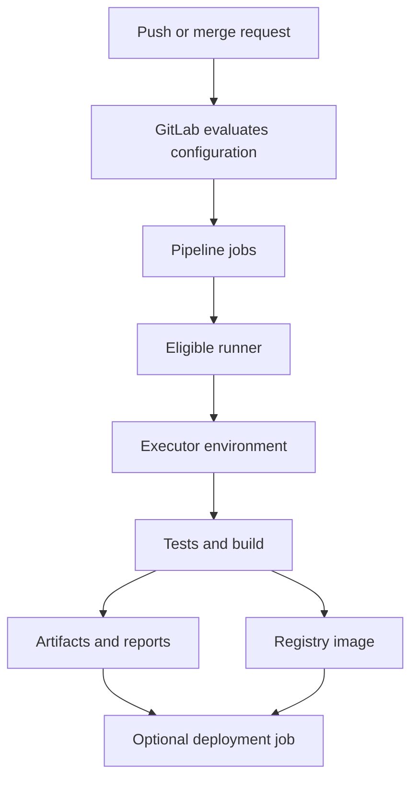

# GitLab: From Repositories to CI/CD

A practical guide for software, DevOps, platform, and build engineers. Learn GitLab projects, merge requests, pipelines, runners, artifacts, registries, releases, security, and troubleshooting through a complete Python example.

**One-file guide:** All example files are included as code blocks. Upload this document as `README.md` in your repository and create the sample project files locally when practising.

> **Scope:** Examples target modern GitLab CI/CD and Linux runners. GitLab.com, Self-Managed, and Dedicated can differ in available features, settings, and quotas. Check the documentation for your GitLab version and subscription. Examples are learning configurations, not complete production deployments. Documentation was consulted on 6 October 2026. The sample application and unit tests were run locally; YAML, Python, shell syntax, and navigation were checked. Runner registration, GitLab CI Lint, and live pipelines were not executed here.

## Contents

1. [What GitLab does](#1-what-gitlab-does)
2. [Git, GitLab, GitHub, Jenkins, and Gerrit](#2-git-gitlab-github-jenkins-and-gerrit)
3. [Projects, groups, and permissions](#3-projects-groups-and-permissions)
4. [Getting started and authentication](#4-getting-started-and-authentication)
5. [Daily Git workflow](#5-daily-git-workflow)
6. [Merge requests and branch protection](#6-merge-requests-and-branch-protection)
7. [Issues and project planning](#7-issues-and-project-planning)
8. [CI/CD architecture](#8-cicd-architecture)
9. [Pipeline YAML fundamentals](#9-pipeline-yaml-fundamentals)
10. [Complete application and pipeline](#10-complete-application-and-pipeline)
11. [Workflow rules and job rules](#11-workflow-rules-and-job-rules)
12. [Stages, needs, and dependencies](#12-stages-needs-and-dependencies)
13. [Variables and secrets](#13-variables-and-secrets)
14. [Cache versus artifacts](#14-cache-versus-artifacts)
15. [Runner installation and registration](#15-runner-installation-and-registration)
16. [Executors, tags, and runner capacity](#16-executors-tags-and-runner-capacity)
17. [Docker builds and Container Registry](#17-docker-builds-and-container-registry)
18. [Environments, deployments, and rollback](#18-environments-deployments-and-rollback)
19. [Schedules, triggers, and APIs](#19-schedules-triggers-and-apis)
20. [Reusable configuration and downstream pipelines](#20-reusable-configuration-and-downstream-pipelines)
21. [Test reports and security checks](#21-test-reports-and-security-checks)
22. [Packages, releases, and Pages](#22-packages-releases-and-pages)
23. [Jenkins to GitLab mapping](#23-jenkins-to-gitlab-mapping)
24. [Troubleshooting](#24-troubleshooting)
25. [Administration and operational practices](#25-administration-and-operational-practices)
26. [Command reference](#26-command-reference)
27. [Interview questions and exercises](#27-interview-questions-and-exercises)
28. [Official references](#28-official-references)

## 1. What GitLab does

GitLab combines Git repository hosting with collaboration and delivery features. Teams can plan work, review changes, run CI/CD, distribute packages/images, and track releases in one platform.

GitLab coordinates pipelines; **GitLab Runner executes most CI jobs**. A project with a valid pipeline file still needs an eligible, available runner to execute its script jobs.

| Offering | Typical responsibility split |
|---|---|
| GitLab.com | GitLab operates the service; you manage projects, permissions, and your delivery configuration |
| Self-Managed | Your organization operates the GitLab installation and supporting infrastructure |
| Dedicated | Managed deployment with its own service/administration boundaries |

Do not assume every feature or runner quota is included in every subscription. Hosting GitLab yourself also does not eliminate runner, storage, backup, and maintenance costs.

## 2. Git, GitLab, GitHub, Jenkins, and Gerrit

| Tool | Main purpose | Connection to GitLab |
|---|---|---|
| Git | Distributed version control | Underlying repository workflow |
| GitLab | Repository collaboration and delivery platform | Hosts projects and coordinates CI/CD |
| GitHub | Another repository/collaboration platform | Similar concepts, different automation and administration |
| Jenkins | Pipeline orchestration | Can integrate with GitLab or be replaced for selected CI workflows |
| Gerrit | Change-oriented code review | Different review model from GitLab merge requests |
| GitLab Runner | Job execution agent | Runs scripts using a configured executor |
| Docker | Container build/runtime tooling | Can supply job environments or build application images |
| Kubernetes | Container orchestration | Can run runner job Pods or receive application deployments |

Git commands such as `clone`, `commit`, and `push` are not unique to GitLab. A merge request is roughly comparable to a pull request, but project policies and pipeline behavior still need platform-specific configuration.

## 3. Projects, groups, and permissions

A **project** contains a repository and related work such as issues, merge requests, CI configuration, and artifacts. **Groups/subgroups** organize projects and can provide inherited membership and settings.

| Concept | Example |
|---|---|
| Namespace | `platform-team` |
| Subgroup | `platform-team/services` |
| Project path | `platform-team/services/greeting` |
| Default branch | Often `main`, but configurable |
| Visibility | Public/private and other instance-supported choices |

Typical roles include Guest, Reporter, Developer, Maintainer, and Owner, with additional/custom roles depending on offering. Exact permissions depend on scope, inheritance, version, and project protection settings.

Use the smallest role needed. Do not assume a Developer can push to a protected branch or access production variables. Review inherited group access as well as direct project membership.

## 4. Getting started and authentication

For learning, create a GitLab project and use an available runner before attempting to install an entire GitLab server.

### SSH access

Create a new key only if you need one; preserve existing keys:

```bash
ssh-keygen -t ed25519 -C "your-email@example.com"
```

Add the **public** key to your GitLab account. Verify the instance's published SSH host-key fingerprint before accepting a new host connection.

```bash
ssh -T git@gitlab.com
git clone git@gitlab.com:YOUR_NAMESPACE/YOUR_PROJECT.git
```

Replace the namespace/project and use your actual hostname for Self-Managed GitLab. Do not upload or share the private key.

### HTTPS and tokens

Use a suitable access token or approved credential flow with the required scope. Store credentials in a credential manager or CI secret facility rather than in repository URLs.

| Credential | Typical use |
|---|---|
| Personal access token | User-authorized Git/API access |
| Project/group access token | Scoped automation where available |
| Deploy token | Supported repository/registry/package access |
| CI job token | Short-lived, restricted job access |
| Runner authentication token | Connect a runner manager to GitLab |

These credentials are not interchangeable. Use expiration, rotation, and minimal scopes appropriate to each purpose.

## 5. Daily Git workflow

Run from a clean working tree; replace `main` if the project uses another default branch:

```bash
git switch main
git pull --ff-only
git switch -c feature/add-greeting
# Edit and test files.
git status
git diff
git add src/app.py tests/test_app.py
git commit -m "Add greeting behavior and tests"
git push -u origin feature/add-greeting
```

Open a merge request from the feature branch to the target branch. Continue pushing commits to the source branch to update it.

For conflicts, fetch the target branch, integrate according to your team's merge/rebase policy, resolve carefully, and rerun tests. A rebase rewrites commit identities. If your policy requires updating a rebased remote branch, coordinate and use `--force-with-lease` rather than overwriting someone else's work blindly.

## 6. Merge requests and branch protection

A useful merge request explains the problem, intended behavior, changes, and validation. Keep it small enough to review. Use a draft while work is incomplete.

Reviewers assess the diff and test evidence; maintainers configure merge permissions and project policy. Protect important branches to restrict direct pushes and define who may merge. Approval rules, Code Owners enforcement, merged-results pipelines, and merge trains have version/tier-specific availability.

An ordinary merge request pipeline is not necessarily testing the exact eventual merged result. Use the appropriate merged-result/merge-train workflow where supported when that distinction matters.

Treat changes to `.gitlab-ci.yml` as executable code. A malicious job can misuse credentials available to its context. Review untrusted/fork contributions before running them with privileged runners or sensitive variables.

## 7. Issues and project planning

Use issues to capture desired behavior, acceptance criteria, and supporting context. Labels classify work; milestones group planned outcomes; boards help track progress.

Link merge requests to issues so reviewers can trace intent. Issue-closing references such as `Closes #123` can connect merging and completion according to project behavior.

Templates improve consistency. Avoid placing passwords, customer data, or internal credentials in issues, attachments, or public pipeline logs.

## 8. CI/CD architecture



A runner requests eligible work from GitLab, prepares its executor environment, obtains sources, runs job commands, and reports results. Runner connectivity and tags influence whether a job can start.

The `image:` keyword defines a job container image for supporting executors. It does **not** mean GitLab builds that image, and a shell executor does not create that container just because `image:` exists.

## 9. Pipeline YAML fundamentals

GitLab normally reads `.gitlab-ci.yml` from the repository root, unless the project configures another path.

| Keyword | Main role |
|---|---|
| `stages` | Define stage ordering |
| `script` | Commands executed by a script job |
| `default` | Supported defaults inherited by jobs |
| `image` | Job execution image for compatible executors |
| `services` | Auxiliary service containers for supported executors |
| `rules` | Decide job inclusion and selected attributes |
| `workflow: rules` | Decide whether to create a pipeline |
| `needs` | Express job graph dependencies |
| `artifacts` | Retain outputs and reports |
| `cache` | Reuse downloaded/build dependencies |
| `tags` | Match eligible runners |
| `environment` | Track deployment environment metadata |

Use spaces for YAML indentation. A shell command containing `: ` can accidentally parse as a YAML mapping; quote it or use a block scalar. Validate configuration using your instance's Pipeline Editor/CI Lint. A generic YAML parser cannot validate GitLab's complete configuration semantics.

## 10. Complete application and pipeline

Create these files in a new learning project:

| File | Purpose |
|---|---|
| `src/app.py` | Application and CLI |
| `tests/test_app.py` | Unit tests compatible with unittest and pytest |
| `requirements-dev.txt` | Test dependency |
| `.gitlab-ci.yml` | Validate, test, package, verify |
| `.gitignore` | Exclude generated files |

### src/app.py

```python
import argparse


def greeting(name):
    cleaned = name.strip()
    if not cleaned:
        raise ValueError("Name must not be empty")
    return f"Hello, {cleaned}!"


def main():
    parser = argparse.ArgumentParser(description="Greeting CLI")
    parser.add_argument("name")
    args = parser.parse_args()
    print(greeting(args.name))


if __name__ == "__main__":
    main()
```

### tests/test_app.py

```python
import unittest
from app import greeting


class GreetingTests(unittest.TestCase):
    def test_name(self):
        self.assertEqual(greeting("Hemant"), "Hello, Hemant!")

    def test_whitespace(self):
        self.assertEqual(greeting("  DevOps  "), "Hello, DevOps!")

    def test_empty_name(self):
        with self.assertRaises(ValueError):
            greeting("")

    def test_whitespace_only(self):
        with self.assertRaises(ValueError):
            greeting("   ")
```

### requirements-dev.txt

```text
pytest>=8,<10
```

This is a bootstrap constraint, not a complete dependency lock. After validating a clean environment, capture and review exact versions through your team's locking workflow.

### .gitignore

```gitignore
.venv/
__pycache__/
.pytest_cache/
.cache/
dist/
reports/
```

### .gitlab-ci.yml

```yaml
workflow:
  rules:
    - if: '$CI_PIPELINE_SOURCE == "merge_request_event"'
    - if: '$CI_PIPELINE_SOURCE == "push" && $CI_COMMIT_BRANCH && $CI_OPEN_MERGE_REQUESTS'
      when: never
    - if: '$CI_PIPELINE_SOURCE == "push"'
    - if: '$CI_PIPELINE_SOURCE == "schedule"'
    - if: '$CI_PIPELINE_SOURCE == "web"'
    - when: never

stages:
  - validate
  - test
  - package
  - verify

default:
  image: python:3.13-slim
  interruptible: true

variables:
  PYTHONPATH: "$CI_PROJECT_DIR/src"
  PIP_CACHE_DIR: "$CI_PROJECT_DIR/.cache/pip"

syntax:
  stage: validate
  script:
    - python -m compileall -q src tests

unit_tests:
  stage: test
  needs: [syntax]
  cache:
    key:
      files:
        - requirements-dev.txt
      prefix: python313
    paths:
      - .cache/pip/
  script:
    - python -m pip install -r requirements-dev.txt
    - mkdir -p reports
    - python -m pytest tests -q --junitxml=reports/junit.xml
  artifacts:
    when: always
    expire_in: 7 days
    reports:
      junit: reports/junit.xml
    paths:
      - reports/

package_cli:
  stage: package
  needs:
    - job: unit_tests
      artifacts: false
  script:
    - mkdir -p dist
    - python -m zipapp src -m 'app:main' -o dist/greeting.pyz
  artifacts:
    paths:
      - dist/greeting.pyz
    expire_in: 7 days

verify_package:
  stage: verify
  needs:
    - job: package_cli
      artifacts: true
  script:
    - test -f dist/greeting.pyz
    - python dist/greeting.pyz GitLab > actual.txt
    - printf 'Hello, GitLab!\n' > expected.txt
    - diff -u expected.txt actual.txt
```

Use a Docker/Kubernetes executor that supports the job image, or a suitable hosted runner. No tags are set, so an eligible runner must accept untagged jobs. The image tag is a readable lab reference; pin a tested digest for controlled production execution.

The pipeline permits MR, push, schedule, and manually started web pipelines. It suppresses branch push pipelines when an MR is open, while leaving the MR pipeline eligible. Other sources require explicit additions to the workflow.

The package is a Python zip application, not a native executable. It still requires a compatible Python interpreter. Packaging is not publishing or deployment.

### Local verification

```bash
python3 -m venv .venv
source .venv/bin/activate
python -m pip install -r requirements-dev.txt
PYTHONPATH=src python -m pytest tests -q
mkdir -p dist
python -m zipapp src -m 'app:main' -o dist/greeting.pyz
python dist/greeting.pyz GitLab
```

Without installing pytest, the same unit tests can run through the standard library:

```bash
PYTHONPATH=src python3 -m unittest discover -s tests -v
```

Commit the source/configuration files, push a feature branch, and inspect the resulting pipeline. If jobs remain pending, check runner eligibility before changing application code.

## 11. Workflow rules and job rules

`workflow: rules` controls pipeline creation. Job `rules` controls inclusion of that job. Rules are evaluated in order; the first matching rule determines the result.

Optional fragment for a job that should run only on the default branch:

```yaml
rules:
  - if: '$CI_COMMIT_BRANCH == $CI_DEFAULT_BRANCH'
  - when: never
```

Use `$CI_COMMIT_TAG` for tag conditions and `$CI_PIPELINE_SOURCE` for event type. Do not assume `$CI_COMMIT_BRANCH` exists in merge request pipelines; MR-specific variables provide source/target branch information.

`rules: changes` can select jobs for changed files, but its comparison baseline differs by pipeline type. Understand `compare_to` and behavior for new branches/non-push pipelines before relying on it for selective validation.

Prefer `rules` for new configurations. Do not combine `rules` with legacy `only`/`except` in the same job. Avoid a broad final `when: always` unless you have deliberately controlled duplicate pipeline creation.

## 12. Stages, needs, and dependencies

By default, jobs in a later stage wait for earlier stages to complete successfully, while jobs within a stage can run concurrently when runner capacity allows.

`needs` builds a directed job graph and allows eligible work to start without waiting for unrelated jobs. In the lab, `verify_package` waits for and downloads outputs from `package_cli`.

With `needs`, artifact downloads are restricted to the needed jobs configured to provide them. `dependencies` primarily selects earlier-stage artifact downloads; it is not a substitute for the same scheduling graph. Avoid combining both in a job without a clear documented reason.

If a required job can be excluded by rules, align the rules or consider `needs:optional` where semantically correct. Otherwise pipeline creation can fail because its dependency is missing.

## 13. Variables and secrets

| Variable | Typical use |
|---|---|
| `CI_COMMIT_SHA` | Full source revision |
| `CI_COMMIT_REF_SLUG` | Ref name normalized for supported naming uses |
| `CI_DEFAULT_BRANCH` | Configured default branch |
| `CI_PIPELINE_SOURCE` | Trigger type |
| `CI_PROJECT_DIR` | Checkout directory |
| `CI_REGISTRY_IMAGE` | Project's container image namespace when configured |
| `CI_JOB_TOKEN` | Short-lived job credential with limited access |

Keep non-sensitive defaults in YAML. Store sensitive values through approved CI/CD variable or secret-management facilities.

**Masked** means supported log redaction, not protection from malicious code. **Protected** restricts availability to eligible protected contexts. **Hidden**, where supported, controls later UI visibility. **File-type** variables expose a temporary file path rather than the secret value itself.

Environment scopes and variable precedence can affect the value a job receives. Check those settings when a value appears missing or unexpected. Do not print all environment variables to troubleshoot a production credential.

Prefer short-lived cloud credentials through OIDC where supported. Restrict trust by issuer, audience, project/ref, and other relevant claims. `id_tokens` creates a token for an intended audience; cloud-side trust and role configuration still have to be established.

## 14. Cache versus artifacts

| Cache | Artifacts |
|---|---|
| Speeds up repeat work | Transfers/preserves job outputs |
| Often dependencies such as pip downloads | Build packages, test reports, generated files |
| Availability is not guaranteed | Explicit output retention and download behavior |
| Reconstructible on a miss | May be required input for later jobs |

The sample caches pip downloads and publishes the `.pyz` package as an artifact. Do not use a cache as the authoritative way to transfer a release binary.

Choose keys that reflect dependency files, runtime/platform compatibility, and trust boundaries. Avoid caching secrets. Shared runners and distributed caches require appropriate storage configuration; a cache definition alone does not guarantee reuse on another machine.

Artifact paths are relative to the job's project directory. Retention, permissions, and instance limits affect availability. A dotenv report can pass non-sensitive generated values to later jobs, but is not a secure channel for secrets.

## 15. Runner installation and registration

GitLab Runner is separate from the GitLab server. Installing its container does not automatically register it or make project jobs eligible.

For a Docker-hosted runner on a trusted Linux host, select a tested official Runner image tag:

```bash
# Replace with an available, supported release tag before running.
RUNNER_IMAGE='gitlab/gitlab-runner:REPLACE_WITH_RELEASE_TAG'
docker volume create gitlab-runner-config
docker run -d --name gitlab-runner --restart unless-stopped \
  -v gitlab-runner-config:/etc/gitlab-runner \
  -v /var/run/docker.sock:/var/run/docker.sock \
  "$RUNNER_IMAGE"
```

This socket mount lets the runner manager create Docker job containers. Access to a rootful Docker daemon is effectively host-level authority. Use a dedicated trusted runner host; do not expose it to untrusted jobs indiscriminately. This mount does not itself make `docker` commands work inside every job container.

### Current registration workflow

1. Create a runner in the appropriate GitLab project/group/instance settings.
2. Set scope, tags, protected-runner policy, and whether it accepts untagged jobs.
3. Obtain the runner authentication token, commonly prefixed `glrt-`.
4. Register the installed runner with the instance URL and that token.

```bash
docker exec -it gitlab-runner gitlab-runner register
```

For the sample, select the Docker executor and a default image such as `python:3.13-slim`. The job-level image can override that default. Configure tags/run-untagged settings through the supported creation workflow, not old registration-token tutorials.

Legacy registration tokens are deprecated and can be unavailable or disabled. Do not confuse them with modern runner authentication tokens.

```bash
docker exec gitlab-runner gitlab-runner verify
docker logs --tail=100 gitlab-runner
```

Verification checks connectivity/registration, not that every project job has matching tags, permissions, executor prerequisites, or capacity. Keep `/etc/gitlab-runner` persistent; it contains sensitive configuration.

## 16. Executors, tags, and runner capacity

| Executor | Job execution environment | Main consideration |
|---|---|---|
| Shell | Runner host shell | Host tools/state; weaker job isolation |
| Docker | Container on Docker host | Image/tool availability and runtime trust |
| Kubernetes | Job Pods | Cluster permissions, images, resources, network/storage |
| Other supported executors | Version-specific execution models | Check maintenance/support status |

Runner **scope** and **executor** are different. A project runner can use Docker, shell, or another supported executor.

A tagged job needs a runner matching all required tags. An untagged job needs a runner configured to accept it. Protected-runner settings can also prevent a match.

Runner-wide concurrency, runner-specific limits, and executor capacity affect queue time. Do not assign more large build jobs than the host can support. `interruptible: true` makes suitable jobs eligible for supported cancellation behavior; it does not by itself configure every auto-cancel policy.

## 17. Docker builds and Container Registry

GitLab's Container Registry stores OCI/Docker images when enabled and configured. Build tools still need a working builder.

| Build approach | Requirements |
|---|---|
| Trusted shell runner with Docker | Docker available on the runner host |
| Docker-in-Docker | Compatible daemon/client, networking/TLS, often privileged configuration |
| Docker socket binding | Host daemon access; strong trust implications |
| Rootless BuildKit | Compatible runner environment and registry authentication |

A job's `image: docker:...` supplies a client environment, not automatically a Docker daemon.

### Optional container for the sample CLI

Create `Dockerfile`:

```dockerfile
FROM python:3.13-slim
WORKDIR /app
COPY src/app.py ./app.py
USER 10001:10001
ENTRYPOINT ["python", "app.py"]
```

For a dedicated **shell executor** tagged `docker-builder` with Docker access, this independent job can build/push the image. Add `publish` to `stages` before adding the job to the sample pipeline:

```yaml
publish_image:
  stage: publish
  tags: [docker-builder]
  interruptible: false
  rules:
    - if: '$CI_COMMIT_BRANCH == $CI_DEFAULT_BRANCH'
    - when: never
  script:
    - |
      set -eu
      export DOCKER_CONFIG="$(mktemp -d)"
      trap 'rm -rf "$DOCKER_CONFIG"' EXIT
      printf '%s' "$CI_REGISTRY_PASSWORD" | docker login \
        -u "$CI_REGISTRY_USER" --password-stdin "$CI_REGISTRY"
      image_ref="$CI_REGISTRY_IMAGE:$CI_COMMIT_SHA"
      docker build --pull -t "$image_ref" .
      docker push "$image_ref"
```

Here the inherited `image:` has no container effect on a shell executor. Ensure registry variables are available and the runner is trusted. The temporary Docker config avoids leaving credentials in a shared home configuration; it does not make a shared privileged host safe for hostile workloads.

A commit-SHA tag is traceable but can still be overwritten unless registry policy prevents it. Record/promote the resulting immutable digest. Do not rebuild different bytes under the same release identity for each environment.

## 18. Environments, deployments, and rollback

An `environment` entry records where a deployment belongs. It does not provision a server, deploy files, create DNS, or verify an application by itself.

Deployment-job template for a real project, not a runnable addition to the greeting lab:

```yaml
deploy_production:
  stage: deploy
  interruptible: false
  environment:
    name: production
    url: https://app.example.com
  resource_group: production
  rules:
    - if: '$CI_COMMIT_BRANCH == $CI_DEFAULT_BRANCH'
      when: manual
      allow_failure: false
    - when: never
  script:
    - ./ci/deploy.sh
    - ./ci/smoke-test.sh
```

Add a `deploy` stage and implement both scripts with the target platform and release-artifact handoff before using this template. The URL is a placeholder.

`resource_group` serializes matching jobs within its project scope; it is not a global lock across unrelated projects. Also guard against outdated pipelines deploying after newer releases.

A manual job is a user action gate, not automatically a protected-environment approval policy. Configure branch/environment protections and deployment permissions explicitly where supported.

Rollback needs a retained artifact, compatible configuration, and a data-migration strategy. Re-running an old job may use changed external dependencies or scripts, so record exactly what will be restored.

## 19. Schedules, triggers, and APIs

Schedules start pipelines on a configured ref using a cron expression and selected timezone. They do not require a new commit. Schedule-owner permissions and status affect execution.

For **21:30 India time every day**, select `Asia/Kolkata` as the schedule timezone and use:

```text
30 21 * * *
```

If the timezone is UTC instead, the corresponding daily expression is `0 16 * * *`. GitLab scheduling uses cron syntax; do not copy Jenkins' `H` notation into it.

`workflow` and job rules must permit `schedule`. A valid schedule can still produce no usable jobs if configuration excludes them. Scheduled time is not a guarantee of immediate runner execution.

Pipelines can also be started by the UI, API, trigger token, or upstream pipeline. Those sources have different `CI_PIPELINE_SOURCE` values and credential requirements. Prefer typed CI/CD inputs where supported for user-provided parameters; validate values before using them in shell commands.

Webhooks notify external systems; they are not the same as Git repository hooks or runner registration. Verify webhook signatures/secrets and handle retries idempotently.

## 20. Reusable configuration and downstream pipelines

Use `include` and hidden job templates to avoid repeating configuration. Included files must exist and be accessible to the pipeline context.

```yaml
# Fragment; create the included file before using it.
include:
  - local: .gitlab/ci/tests.yml

.python_job:
  image: python:3.13-slim
  before_script:
    - python --version
```

Jobs can use `extends: .python_job`. Understand merge behavior: arrays such as `script` are not automatically appended as if they were a procedural inheritance chain. Pin external reusable configuration to a reviewed revision rather than an uncontrolled moving branch.

Parent-child pipelines split work within one project/ref; multi-project pipelines coordinate separate projects. Downstream creation does not always mean the upstream waits for or reflects the downstream result. Configure the supported `trigger:strategy` behavior, such as `mirror` on versions that support it, intentionally.

For monorepos, combine reviewed includes, appropriate changes rules, and bounded parallelism. Do not hide essential validation behind an overly narrow path filter.

## 21. Test reports and security checks

JUnit XML lets GitLab display individual test results. The lab uses `artifacts:reports:junit`, while the test command's exit code determines failure. Uploading a report alone does not make a successful command fail because the XML contains failures.

Security checks can include secret detection, static analysis, dependency scanning, container scanning, and dynamic testing. Availability and report/approval features depend on tier, version, language, and configuration. A template name alone is not proof that meaningful scanning occurred.

Review the expanded pipeline and scanner output. Define how findings affect merge/release decisions, who owns remediation, and how exceptions expire. Never add `|| true` simply to make required tests or scans appear successful.

A Docker image scan does not replace code tests, runtime hardening, or dependency review. Avoid exposing production secrets to untrusted scanning/build contexts.

## 22. Packages, releases, and Pages

| Feature | Purpose |
|---|---|
| Job artifacts | Pipeline-generated outputs with configured retention |
| Package Registry | Language/general package distribution |
| Container Registry | Container image distribution |
| Git tag | Source-code reference |
| GitLab release | Release metadata and asset links associated with a tag |
| GitLab Pages | Static website hosting from supported pipeline output |

A tag does not automatically build or deploy an application. A release asset link does not guarantee its target artifact will remain available after artifact expiry; use deliberate release retention.

Pages is useful for documentation and static sites. It is not a general backend application server. Use Pages syntax for your installed GitLab version and verify access controls before publishing internal documentation.

## 23. Jenkins to GitLab mapping

| Jenkins concept | GitLab equivalent or closest concept |
|---|---|
| `Jenkinsfile` | `.gitlab-ci.yml` |
| Agent/node label | Runner tags plus eligibility settings |
| Pipeline stage | Stage; `needs` adds a job graph |
| `sh` / `bat` | Job `script` in the runner's shell |
| Credentials binding | CI/CD variables, external secrets, OIDC |
| `archiveArtifacts` | `artifacts:paths` |
| JUnit publishing | `artifacts:reports:junit` |
| Scheduled trigger | Pipeline schedule with explicit timezone |
| Downstream job | Child/multi-project pipeline |
| Build parameters | Inputs or suitable pipeline variables |
| Shared library | Includes, templates, CI/CD components, scripts |
| Concurrency lock | `resource_group` for its supported project scope |

A migration is not just translating Groovy to YAML. Revisit workspace assumptions, runner trust, artifact transfer, authentication, failure behavior, and deployment concurrency. GitLab jobs may run on different machines with fresh filesystems.

## 24. Troubleshooting

| Symptom | Check |
|---|---|
| No pipeline created | CI file location, YAML validity, workflow rules, event source |
| Job missing from pipeline | Job rules and variable availability |
| Job pending/stuck | Runner online state, tags, scope, protection, capacity |
| Runner registered but no jobs | Run-untagged policy and project eligibility |
| `image` seems ignored | Shell executor does not use job containers |
| Docker client cannot connect | Daemon/socket/DinD setup and endpoint |
| Job succeeds locally but fails in CI | Working directory, tool versions, permissions, missing files |
| Artifact not found | Relative path, producer success, `needs`, expiry, permissions |
| Cache miss | Key, paths, backend, runner location, protected/unprotected isolation |
| Variable empty | Scope, protection, precedence, pipeline source |
| Duplicate pipelines | Overlapping push/MR workflow and job rules |
| Pipeline creation fails on `needs` | Needed job excluded by rules or misnamed |
| Schedule does not run | Timezone, owner, ref, workflow, instance limits |
| Tests failed but job green | Ignored exit status or `allow_failure` |
| Registry push denied | Token scope, registry enablement, repository path, protections |
| Exit 137 / OOM | Container and host memory, job concurrency |
| TLS/proxy failures | Approved trust chain, hostname, proxy configuration |

Start with the first meaningful error in the job trace and the expanded configuration. Use CI Lint on your actual instance for syntax/rule validation. Debug tracing can reveal secrets; enable it only with a controlled diagnostic plan.

## 25. Administration and operational practices

For Self-Managed GitLab, use official installation instructions for a supported OS/deployment method. A GitLab server container is different from a GitLab Runner container. Do not assume the Runner image contains the GitLab web application.

Plan DNS, TLS, SSH/HTTP ports, persistent storage, mail, registry configuration, resource requirements, and access policy before deploying a server. Use documented upgrade paths and backups appropriate to the installation method.

Back up repositories, application data, configuration/secrets, and external/object storage according to the supported procedure. Test restoration; a successful backup command is not proof of recovery. Protect runner configuration separately and avoid cloning credential-bearing runner state carelessly.

For reliable CI, retain release provenance, bound job timeouts, rotate credentials, clean only job-owned temporary data, monitor queue time/capacity, and keep runner/runtime versions supported. Use dedicated trust boundaries for production deployment jobs and untrusted contributions.

## 26. Command reference

| Task | Command |
|---|---|
| Clone | `git clone git@gitlab.com:GROUP/PROJECT.git` |
| New branch | `git switch -c feature/change` |
| Inspect changes | `git status` and `git diff` |
| Push branch | `git push -u origin feature/change` |
| Run sample tests without pytest | `PYTHONPATH=src python3 -m unittest discover -s tests -v` |
| Run sample pytest suite | `PYTHONPATH=src python -m pytest tests -q` |
| Inspect runner container | `docker ps -a --filter name=gitlab-runner` |
| Start an existing runner container | `docker start gitlab-runner` |
| Runner logs | `docker logs --tail=100 gitlab-runner` |
| Register containerized runner | `docker exec -it gitlab-runner gitlab-runner register` |
| Verify registration | `docker exec gitlab-runner gitlab-runner verify` |

The GitLab web UI's Pipeline Editor/CI Lint is the validation route for configuration on the target instance. Do not rely on obsolete `gitlab-runner exec` tutorials as a universal local pipeline emulator.

## 27. Interview questions and exercises

**Git versus GitLab?** Git is version control; GitLab provides repository collaboration and delivery services around it.

**Runner versus executor?** Runner coordinates job execution; its executor selects the execution environment.

**Cache versus artifact?** Cache accelerates reconstructible work; artifacts preserve or transfer explicit outputs.

**Stages versus needs?** Stages provide broad ordering; needs defines more specific job dependencies.

**workflow rules versus job rules?** The first controls pipeline creation; the second controls job inclusion.

**Why is a masked variable not fully secure?** Code with access to it may exfiltrate or transform it despite log masking.

**Does a job image provide Docker-in-Docker automatically?** No. Client, daemon, connectivity, and permissions must be configured.

**Why can a protected secret be missing?** The pipeline/ref or environment may not be eligible under protection/scope settings.

**Does an environment declaration deploy an application?** No. Deployment requires real commands and infrastructure.

**Why does the sample pass artifacts explicitly?** Jobs can run on different machines and should not depend on a shared workspace.

Practice in order:

1. Create the sample files and run all four unit tests locally.
2. Push a feature branch and inspect the four-job pipeline.
3. Introduce a failing assertion and verify that packaging does not proceed.
4. Inspect JUnit results and download the packaged application.
5. Open a merge request and check duplicate-pipeline prevention.
6. Register a dedicated learning runner and experiment with tags.
7. Add a harmless schedule using an explicit timezone.
8. Review the optional registry example before adding a trusted builder.
9. Design a deployment job with artifact identity, access controls, verification, and rollback.

## 28. Official references

- [First pipeline](https://docs.gitlab.com/ci/quick_start/)
- [CI/CD YAML reference](https://docs.gitlab.com/ci/yaml/)
- [Roles and permissions](https://docs.gitlab.com/user/permissions/)
- [Merge requests](https://docs.gitlab.com/user/project/merge_requests/)
- [Protected branches](https://docs.gitlab.com/user/project/repository/branches/protected/)
- [Workflow rules](https://docs.gitlab.com/ci/yaml/workflow/)
- [Job rules](https://docs.gitlab.com/ci/jobs/job_rules/)
- [Variables](https://docs.gitlab.com/ci/variables/)
- [Job tokens](https://docs.gitlab.com/ci/jobs/ci_job_token/)
- [Caching](https://docs.gitlab.com/ci/caching/)
- [Artifacts](https://docs.gitlab.com/ci/jobs/job_artifacts/)
- [Runner in Docker](https://docs.gitlab.com/runner/install/docker/)
- [Runner registration](https://docs.gitlab.com/runner/register/)
- [New runner creation workflow](https://docs.gitlab.com/ci/runners/new_creation_workflow/)
- [Executors](https://docs.gitlab.com/runner/executors/)
- [Docker builds](https://docs.gitlab.com/ci/docker/using_docker_build/)
- [Rootless BuildKit](https://docs.gitlab.com/ci/docker/using_buildkit/)
- [Container Registry builds and pushes](https://docs.gitlab.com/user/packages/container_registry/build_and_push_images/)
- [Environments](https://docs.gitlab.com/ci/environments/)
- [Resource groups](https://docs.gitlab.com/ci/resource_groups/)
- [Scheduled pipelines](https://docs.gitlab.com/ci/pipelines/schedules/)
- [Configuration includes](https://docs.gitlab.com/ci/yaml/includes/)
- [Downstream pipelines](https://docs.gitlab.com/ci/pipelines/downstream_pipelines/)
- [Unit test reports](https://docs.gitlab.com/ci/testing/unit_test_reports/)
- [OIDC ID tokens](https://docs.gitlab.com/ci/secrets/id_token_authentication/)
- [Application security](https://docs.gitlab.com/user/application_security/)
- [Releases](https://docs.gitlab.com/user/project/releases/)
- [Pages](https://docs.gitlab.com/user/project/pages/)
- [Self-Managed Docker installation](https://docs.gitlab.com/install/docker/)
